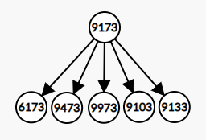

# SPOJ - Prime Path

[PPATH](https://www.spoj.com/problems/PPATH/)

Given a 4 digit prime number, transform it into another given prime by changing digits one by one. Each intermediary must also be a prime.

Find the solution with the minimum number of digit changes.

The first digit can't be 0, so `1000 <= P <= 9999`

## Input

An integer N, the number of test cases followed by N pairs, the initial prime and the goal prime.

## Output

The minimal number of operations for each test case.

### Example

<pre>
<b>Input:</b>
3
1033 8179
1373 8017
1033 1033

<b>Output:</b>
6
7
0
</pre>

---

## Solution

Consider a tree with the initial given prime as its root. The descendents of each node in this tree are the possible primes generated from it. The problem now sounds like finding the minimum depth at which our goal prime appears at and that is easily solved with breath-first search.

**Eg:**
> 9173 1973  
>
>The primes you can generate from `9173` are:  
  
>
>Each node has more than a few descendants so I won't put the full tree here, but 1973 is the first number generated from 9973 and so we find the goal at depth 2

So now all we need is a fast method to check if a number is prime, and a table is a O(1) solution.  

## Compile Time Sieve

Explained better than I can at [Sieve of Eratosthenes](https://en.wikipedia.org/wiki/Sieve_of_Eratosthenes)

Based on the implementations at:  
[compile time square root](https://github.com/wichtounet/articles/blob/master/src/sqrt/smart_constexpr.cpp)  
[compile time sieve](https://gist.github.com/rongjiecomputer/d52f34d27a21b8c9c9e82ca85b806640)

Begin with every number marked as prime. Then for every prime, mark every one of its multiples as non-primes. You don't have to check past sqrt(N).

```cpp
template <size_t N>
struct Sieve {
    bool is_prime[N];

    constexpr Sieve() : is_prime{} {
        is_prime[0] = is_prime[1] = false;

        for (size_t i = 2; i < N; i++)
            is_prime[i] = true;

        for (size_t i = 2; i < ct_sqrt(N); i++)
            if (is_prime[i])
                for (size_t j = i*i; j < N; j += i)
                    is_prime[j] = false;
    }
};

// This will build the sieve at compile-time
static constexpr auto sieve = Sieve<MAX>();
```

## BFS

Standard BFS implementation using [std::queue](https://en.cppreference.com/w/cpp/container/queue).

We're bruteforcing the descendant generation. For every digit of the current number, test replacing it with any digit \[0-10\] and push it to the queue if it's valid (following the constraints of the problem).

I use string to int and int to string coversions since strings are easier to manipulate.

To get the char representation of a digit just sum it to `'0'`.  
Chars are represented internally as their ASCII table id. Since `'0'` is the first digit in the ASCII table you can get the other digits by calculating the distance to `'0'`, which is obviously the same as the actual digit as they're in order.

**Eg:**
> `'0' + 5 = '5'`

```cpp
int bfs(int start, int goal) {
    queue<int> q;
    vector<int> visited(MAX);
    vector<int> depth(MAX);

    q.push(start);
    visited[start] = true;
    depth[start] = 0;

    while(!q.empty()) {
        int current = q.front();
        q.pop();

        if (current == goal)
            return depth[current];

        string curr_string = to_string(current);

        for(int i = 0; i < 4; i++) {
            for(int j = 0; j < 10; j++) {
                string next{curr_string};
                next[i] = j + '0';  

                int num = stoi(next); // string to int
                if (num >= 1000 && !visited[num] && sieve.is_prime[num]) {
                    q.push(num);
                    visited[num] = true;
                    depth[num] = depth[current] + 1;
                }
            }
        }
    }

    return 0;
}
```

## Full code

```cpp
#include <iostream>
#include <queue>
#include <vector>

#define DEBUG(x) cout << #x << ": " << x << endl;
#define MAX 10000

using namespace std;

static constexpr std::size_t ct_sqrt(std::size_t res, std::size_t l, std::size_t r){
    if(l == r){
        return r;
    } else {
        const auto mid = (r + l) / 2;

        if(mid * mid >= res){
            return ct_sqrt(res, l, mid);
        } else {
            return ct_sqrt(res, mid + 1, r);
        }
    }
}

static constexpr std::size_t ct_sqrt(std::size_t res){
    return ct_sqrt(res, 1, res);
}


template <size_t N>
struct Sieve {
    bool is_prime[N];

    constexpr Sieve() : is_prime{} {
        is_prime[0] = is_prime[1] = false;

        for (size_t i = 2; i < N; i++)
            is_prime[i] = true;

        for (size_t i = 2; i < ct_sqrt(N); i++)
            if (is_prime[i])
                for (size_t j = i*i; j < N; j += i)
                    is_prime[j] = false;
    }
};

static constexpr auto sieve = Sieve<MAX>();

int bfs(int start, int goal) {
    queue<int> q;
    vector<int> visited(MAX);
    vector<int> depth(MAX);

    q.push(start);
    visited[start] = true;
    depth[start] = 0;

    while(!q.empty()) {
        int current = q.front();
        q.pop();

        if (current == goal)
            return depth[current];

        string curr_string = to_string(current);

        for(int i = 0; i < 4; i++) {
            for(int j = 0; j < 10; j++) {
                string next{curr_string};
                next[i] = j + '0';

                int num = stoi(next);
                if (num >= 1000 && !visited[num] && sieve.is_prime[num]) {
                    q.push(num);
                    visited[num] = true;
                    depth[num] = depth[current] + 1;
                }
            }
        }
    }

    return 0;
}

int main() {
    ios::sync_with_stdio(0);
    cin.tie(NULL);

    int n;
    cin >> n;

    while(n--) {
        int a, b;
        cin >> a >> b;
        cout << bfs(a, b) << endl;
    }

    return 0;
}
```